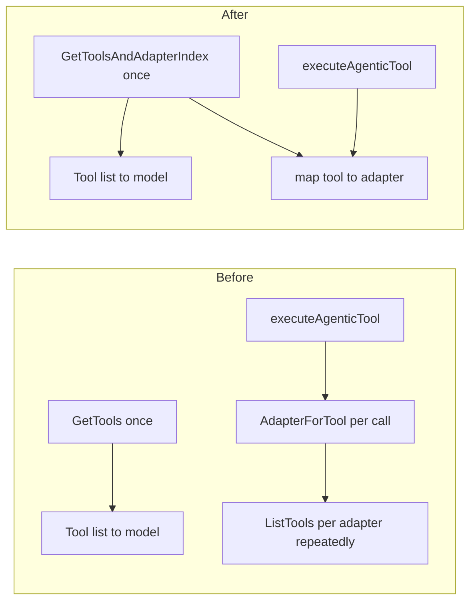

# Fix capability registry and agentic worker review findings

## Validity summary

| Finding | Valid? | Notes |
|---------|--------|--------|
| [registry.go](internal/capabilities/registry.go) nil `adapter` before `ListTools` | **Yes** | `names` is collected under `RLock`, then the lock is released. Another goroutine can `Unregister` before `r.adapters[name]` is read on a later iteration, so the map lookup returns the zero interface (`nil`). Calling `ListTools` on a nil interface panics. Storing `nil` via `Register` would also panic. |
| `r.allTools` under `RLock` | **Yes** | Multiple goroutines can hold `RLock` at once; each `GetTools` assigns to `r.allTools` → concurrent writes → data race. Grep shows `r.allTools` is never read ([registry.go](internal/capabilities/registry.go) only). |
| `AdapterForTool` on every capability tool call | **Yes** | [`executeAgenticTool`](internal/queue/worker/worker.go) calls `AdapterForTool`, which loops adapters and calls `ListTools` per adapter ([registry.go](internal/capabilities/registry.go) L89–102). The same iteration already happened in `agenticTools` via `GetTools`, so each tool execution repeats remote/list work and can hit transient errors that were not present when tools were first listed. |
| `TestToolExecutor_Read_RejectsOversizedFile` + `t.Parallel` + global | **Yes** | [tool_executor_test.go](internal/queue/worker/tool_executor_test.go) mutates package-level `maxToolReadFileBytes` while `t.Parallel()` allows overlap with other tests. |
| Hard-coded `len(got) != 4` | Optional | Correctness nit; not a bug. Skip unless you want slightly more resilient tests. |

---

## 1. Registry: nil-safe `AdapterForTool` and remove `r.allTools` race

**File:** [internal/capabilities/registry.go](internal/capabilities/registry.go)

- In `AdapterForTool`, use a two-value map lookup and skip when missing or `adapter == nil` before `ListTools` (matches the bot’s suggested `continue` pattern).
- Remove the `allTools` struct field and the assignment `r.allTools = allTools` in `GetTools` (return the local slice only), eliminating the concurrent-write race.

Add a short unit test if useful: e.g. unregister racing with `AdapterForTool` is hard to test deterministically; the nil-guard is the fix.

---

## 2. Registry + worker: one `ListTools` pass per agentic run for tool → adapter routing

**Goal:** Build `toolName → adapterName` once with the same ordering rule as today: **iterate adapters in lexicographically sorted name order**; for each tool name, first adapter wins (matches [`TestRegistry_AdapterForTool`](internal/capabilities/registry_test.go) expectations).

**Registry**

- Add something like `GetToolsAndAdapterIndex(ctx) ([]gateway.ToolDefinition, map[string]string, error)` that holds `RLock` for the whole operation (same contention profile as current `GetTools`), iterates **sorted** adapter names, nil-skips adapters, aggregates definitions, and fills the map only when `index[toolName]` is not yet set.
- Implement `GetTools` as a thin wrapper: call the new method and return `tools, err` only (no shared mutable cache field).

**Worker**

- Extend [`agenticTools`](internal/queue/worker/worker.go) to return both the tool slice and the `map[string]string` (on capability error / nil registry, return `nil` map as today’s “no capability routing” behavior).
- Thread that map into [`executeAgenticTool`](internal/queue/worker/worker.go): for non-builtin tools, resolve `adapterName` from the map instead of `AdapterForTool`. Keep `AdapterForTool` on the registry for tests and any other callers, with the nil-guard above.

**Tests**

- [`TestExecuteAgenticTool_CapabilityRegistry`](internal/queue/worker/worker_agentic_test.go): pass the expected map (e.g. `map[string]string{"capability_tool": "fake"}`) into `executeAgenticTool` after signature change, or build it via the new registry API once per test.

---

## 3. Tool executor test: remove `t.Parallel()` from the global-mutation test

**File:** [internal/queue/worker/tool_executor_test.go](internal/queue/worker/tool_executor_test.go)

- Remove `t.Parallel()` from `TestToolExecutor_Read_RejectsOversizedFile` only (minimal fix). Refactoring `maxToolReadFileBytes` onto `ToolExecutor` is larger scope and not required if the goal is minimal, correct tests.

---

## 4. Optional (skip by default)

- **worker_agentic_test.go** derived tool count: improves maintainability only; not required for correctness.

---

## Validation

- `go test ./internal/capabilities/... ./internal/queue/worker/...` (and any package that imports the new registry API if signatures change only on worker private methods / new exported registry method).

