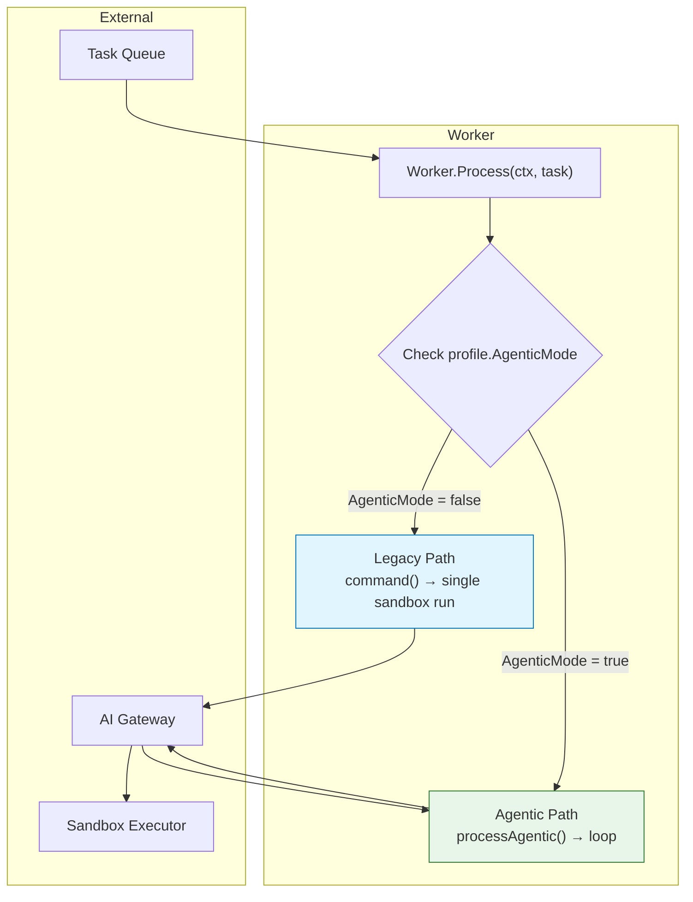

# Design Document: Agentic Worker Mode Toggle

## Overview

This document describes the design for the agentic worker mode toggle feature. The toggle enables operators to opt-in to an inner agentic loop with tool calling, message accumulation, and multiple sandbox executions while keeping the default single-shot JSON worker behavior unchanged for existing deployments.

## Architecture

### System Diagram



### Components

| Component | Location | Description |
|-----------|----------|-------------|
| `Worker` | `internal/queue/worker/worker.go` | Main worker that processes tasks from the queue |
| `AgentProfile` | `internal/models/entities.go` | Configuration entity with `AgenticMode` boolean field |
| `processAgentic` | `internal/queue/worker/worker.go` | Method implementing the agentic inner loop |

### Data Flow

#### Legacy Mode (Default)
1. `Worker.Process` receives task from queue
2. Load `AgentProfile` via `profile.AgenticMode` → false
3. Execute `command()` which calls `gateway.GenerateJSON[workerResponse]`
4. Run single sandbox execution
5. Commit result to task

#### Agentic Mode
1. `Worker.Process` receives task from queue
2. Load `AgentProfile` via `profile.AgenticMode` → true
3. Verify provider supports agentic mode (`providerSupportsAgentic` returns true for OpenAI)
4. Execute `processAgentic()` which:
   - Builds initial messages with tool definitions
   - Loops: call gateway → execute tools → accumulate messages → repeat
   - Commit final text result when no more tool calls

## Low-Level Design

### AgentProfile Struct

```go
// AgentProfile configures a concrete model/provider pair.
type AgentProfile struct {
    ID           string
    Name         string
    Provider     string
    Model        string
    Temperature  float64
    SystemPrompt sql.NullString
    Role         string
    MaxTokens    int
    // AgenticMode enables the inner agentic loop with tool calling.
    // When false (default), the worker uses legacy single-shot JSON mode.
    // When true and provider supports agentic mode, the worker executes
    // the inner loop via processAgentic.
    AgenticMode  bool
    UpdatedAt    time.Time
}
```

### Worker.Process Routing Logic

```go
func (w *Worker) Process(ctx context.Context, task models.Task) {
    // ... load project and profile ...
    project, profile, err := w.loadContext(ctx, task)
    
    // Agentic mode routing
    if profile.AgenticMode {
        if w.providerSupportsAgentic(*profile) {
            // Route to agentic inner loop
            w.processAgentic(ctx, task, *project, *profile)
            return
        }
        // Fall back to legacy mode with warning
        slog.Warn("agentic mode requested but provider does not support...",
            "provider", profile.Provider)
    }
    
    // Legacy single-shot JSON command path
    response, err := w.command(ctx, task, *profile)
    // ... execute single sandbox run ...
}
```

### Provider Capability Check

```go
// providerSupportsAgentic returns true only for providers that support
// tool round-tripping (currently OpenAI).
func (w *Worker) providerSupportsAgentic(profile models.AgentProfile) bool {
    return strings.EqualFold(profile.Provider, string(gateway.ProviderOpenAI))
}
```

### processAgentic Method Signature

```go
// processAgentic implements the agentic inner loop with tool calling,
// message accumulation, and multiple sandbox executions.
func (w *Worker) processAgentic(
    ctx context.Context,
    task models.Task,
    project models.Project,
    profile models.AgentProfile,
) {
    // 1. Set up cancel context and tool executor
    // 2. Build initial messages with tool definitions
    // 3. Create guardrails: iteration, budget, deadline, truncation
    // 4. Loop:
    //    - Check guardrails
    //    - Call gateway with tools
    //    - If no tool calls: commit text result and return
    //    - Execute each tool call and accumulate results
    //    - Continue loop
}
```

## Implementation Status

**This feature is already implemented.** The current codebase contains:

| Component | Status | Location |
|-----------|--------|----------|
| `AgentProfile.AgenticMode` | ✅ Implemented | `internal/models/entities.go:50` |
| `Worker.Process` routing | ✅ Implemented | `internal/queue/worker/worker.go:119-128` |
| `providerSupportsAgentic` | ✅ Implemented | `internal/queue/worker/worker.go:382-384` |
| `processAgentic` full implementation | ✅ Implemented | `internal/queue/worker/worker.go:216-320` |

### Key Implementation Details

1. **Default Behavior**: `AgenticMode` defaults to `false` (Go zero value), ensuring legacy behavior is unchanged for existing deployments.

2. **Provider Support**: Only OpenAI providers support agentic mode. Other providers fall back to legacy mode with a warning log.

3. **processAgentic Features**:
   - Tool execution via `ToolExecutor`
   - Iteration guard to prevent infinite loops (`maxToolIterations`)
   - Budget guard to track token usage
   - Deadline guard for context timeout
   - Truncation for large message histories
   - Support for MCP capabilities via `capabilities.Registry`

4. **Fallback Handling**: When agentic mode is enabled but provider doesn't support it, the system logs a warning and falls back to legacy mode gracefully.

## Testing Strategy

### Unit Tests

- `TestProviderSupportsAgentic`: Verify OpenAI returns true, other providers return false
- Test routing logic with various `AgenticMode` values

### Integration Tests

- Verify legacy path executes single sandbox run
- Verify agentic path enters loop and handles tool calls
- Verify fallback from agentic to legacy for unsupported providers

### Test Configuration

| Field | Legacy Test | Agentic Test |
|-------|-------------|--------------|
| `AgenticMode` | `false` | `true` |
| `Provider` | any | `openai` |

## Correctness Properties

This feature primarily involves configuration routing and infrastructure wiring rather than pure function logic with universal properties. Property-based testing is not applicable here. The behavior is validated through:

1. **Example-based unit tests** for routing conditions
2. **Integration tests** for end-to-end execution paths
3. **Regression tests** to ensure legacy behavior remains unchanged

## Error Handling

| Scenario | Handling |
|----------|----------|
| Agentic mode + unsupported provider | Log warning, fall back to legacy mode |
| Tool execution failure | Return error JSON to gateway, continue loop |
| Iteration limit exceeded | Handle via `handleIterationExceeded`, commit failure |
| Budget exceeded | Handle via `budgetGuard.BeforeCall`, commit partial result |
| Context deadline exceeded | Exit loop gracefully via `deadlineGuard` |

## Documentation

- `AgentProfile.AgenticMode`: Code comment explains purpose and behavior
- `Worker.Process`: Comments explain routing logic for agentic vs legacy
- `docs/agentic-harness.md`: Long-form documentation of the agentic harness architecture