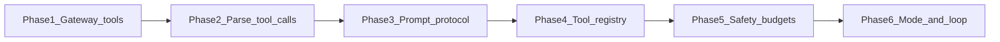

# Agentic harness — implementation roadmap

Phased work to add an **opt-in inner agentic loop** (tool calling with accumulated messages inside `Worker.Process`) while keeping the **default** single-shot JSON worker unchanged until explicitly enabled.

Canonical architecture and terminology: [docs/agentic-harness.md](agentic-harness.md).

## Phase dependency overview

Post-MVP items (tasks 08–12) extend observability, routing, truncation, tests, and additional providers;
see the end of this document.

## Implementation status

- **Phases 1–6 (MVP): DONE.** Gateway tool schemas, tool-call parsing, prompt tool protocol, tool
  executor registry, iteration/safety budgets, and the opt-in agentic inner loop are all
  implemented and tested (`internal/gateway/`, `internal/agent/tools/`,
  `internal/queue/worker/agentic/`).
- **Tasks 08, 09, 10, 11: DONE** (tool-call events + SSE server side, provider capabilities +
  fallback, agentic context truncation, agentic loop integration tests).
- **Task 12 (provider expansion): RE-SCOPED.** Per-provider native tool formats are no longer the
  growth path — see [Milestone 13](llm-connector-strategy.md). The recommended approach
  is the **two-topology connector model**: a hardened OpenAI Chat Completions wire path plus an
  external proxy (LiteLLM / Portkey / OpenRouter) for provider diversity (see
  `docs/llm-connector-strategy.md`, authored in Milestone 13).
- **Milestones 13–19** are tracked below; each began as a self-contained PR-scoped spec in
  `tasks/` (the spec files remain tracked there; the work they describe has landed).

---

## Forward milestones (13–19)

| Task | Topic | Status |
| --- | --- | --- |
| [13-llm-connector-strategy](../tasks/13-llm-connector-strategy.md) | Docs-only: two-topology model, keep/delegate table, non-goals, cache discipline, LiteLLM recipe, provider-claim corrections, roadmap bookkeeping. | Completed |
| [14-cache-hygiene-stable-prefix](../tasks/14-cache-hygiene-stable-prefix.md) | Cache hygiene: stable prefix (memory-lesson ordering, deterministic tool lists) + byte-stability golden test. | Completed |
| [15-cache-observability-usage-details](../tasks/15-cache-observability-usage-details.md) | Surface prompt-cache `cached_tokens` / DeepSeek cache fields via `AIResponse` usage details + TOKEN_USAGE events. | Completed |
| [16-wire-contract-and-smoke-script](../tasks/16-wire-contract-and-smoke-script.md) | Openai-adapter wire-contract test suite + `scripts/llm-smoke.sh` conformance probe. | Completed |
| [17-llamacpp-agentic-recipe](../tasks/17-llamacpp-agentic-recipe.md) | (Optional) llama.cpp agentic recipe + optional capability probe. | Completed |
| [18-litellm-correlation-metadata](../tasks/18-litellm-correlation-metadata.md) | (Optional) LiteLLM task-correlation metadata + startup topology log. | Completed |
| [19-cockpit-tool-event-rendering](../tasks/19-cockpit-tool-event-rendering.md) | Web/independent: render `tool_called` / `tool_result` SSE events in the cockpit. | Completed |

Suggested execution order: `13 → (14, 16, 19 can run in parallel) → 15 (after 14) → 17/18 (after
16)`.

---

## Phase 1: Gateway tool definitions

**Goal**: `AIRequest` can carry OpenAI-style tool schemas; OpenAI provider sends `tools` and avoids conflicting JSON response formats when tools are present.

**Depends on**: nothing.

**Primary files**: [`internal/gateway/spec/spec.go`](../internal/gateway/spec/spec.go), [`internal/gateway/providers/openai.go`](../internal/gateway/providers/openai.go), [`internal/gateway/exports.go`](../internal/gateway/exports.go) if types are re-exported.

**Verification**: Existing tests pass; new test marshals an `AIRequest` with tools and asserts JSON body shape (and correct interaction with JSON mode when tools are set).

**Status**: Complete. Gateway tool schemas + OpenAI `tools` request wiring live in `internal/gateway/spec/spec.go` and `internal/gateway/providers/openai.go` with fixture tests.

---

## Phase 2: Tool call parsing in responses

**Goal**: `AIResponse` exposes parsed `tool_calls` from the provider so callers can branch without ad-hoc JSON.

**Depends on**: Phase 1 (types and request wiring should exist; parsing can land immediately after).

**Primary files**: [`internal/gateway/spec/spec.go`](../internal/gateway/spec/spec.go), [`internal/gateway/providers/openai.go`](../internal/gateway/providers/openai.go).

**Verification**: Unit test with stubbed OpenAI JSON containing `tool_calls` asserts populated `AIResponse.ToolCalls`.

**Status**: Complete. `AIResponse.ToolCalls` parsing lives in `internal/gateway/spec/spec.go` + `internal/gateway/providers/openai.go`, with fixture tests.

---

## Phase 3: Prompt message tool protocol

**Goal**: `PromptMessage` and marshaling support assistant messages with `tool_calls` and tool messages with `tool_call_id` (OpenAI chat format). No worker behavior change required yet.

**Depends on**: Phases 1–2.

**Primary files**: [`internal/gateway/spec/spec.go`](../internal/gateway/spec/spec.go), [`internal/gateway/providers/openai.go`](../internal/gateway/providers/openai.go) (or a dedicated mapper if introduced).

**Verification**: Round-trip / marshal tests for multi-turn assistant+tool message lists.

**Status**: Complete. `PromptMessage.ToolCalls` / `ToolCallID` round-trip tested in `spec_test.go` and `providers/openai_test.go`.

---

## Phase 4: Tool executor registry

**Goal**: Register `bash`, `read`, and `write` tools with JSON schemas; execute them via sandbox and filesystem rules **without** an LLM loop.

**Depends on**: Phase 3 (tool result messages should match the wire protocol).

**Primary files**: new under [`internal/queue/worker/`](../internal/queue/worker/) or [`internal/sandbox/`](../internal/sandbox/) per task; integrate with existing `BashExecutor` and path safety.

**Verification**: Unit tests for each tool’s argument validation and execution (mock sandbox where appropriate).

**Status**: Complete. Tool executor registry (`bash`, `read`, `write`) lives in `internal/agent/tools/` (`tool_executor.go` + jail/manifest/path tests).

---

## Phase 5: Iteration budget and safety

**Goal**: Max tool iterations, interaction with task wall-clock deadline and token budget, clear behavior when limits are exceeded (forced completion path or handoff). Tool failures return as tool output, not outer retry.

**Depends on**: Phase 4.

**Primary files**: [`internal/queue/worker/worker.go`](../internal/queue/worker/worker.go), [`internal/config/`](../internal/config/) as needed for limits.

**Verification**: Unit tests for cap exhaustion and timeout interaction; no new bus event types in this phase.

**Status**: Complete. Iteration/deadline/budget guards live in `internal/agent/runtime/guards.go` and `internal/gateway/budget.go`; config `queue.max_tool_iterations`.

---

## Phase 6: Opt-in mode and inner loop orchestration

**Goal**: (6a) Profile or config selects **agentic** vs **legacy** worker path (default legacy). (6b) In agentic mode, `Worker.Process` runs the LLM → tool → result loop using accumulated messages, registry, and guards from prior phases.

**Depends on**: Phases 3–5.

**Primary files**: [`internal/queue/worker/worker.go`](../internal/queue/worker/worker.go), [`internal/models/`](../internal/models/) if profile fields are added, config as needed.

**Verification**: Manual or automated scenario with agentic mode on; regression that default profile still uses `GenerateJSON` / single-shot path.

**Status**: Complete. `AgentProfile.AgenticMode` + `processAgentic` inner loop (`internal/queue/worker/worker.go`, `internal/queue/worker/agentic/`), incl. hooks, HITL, goals, subagents, model & capability routing.

---

## Completed & re-scoped post-MVP work

| Task | Topic | Status |
| --- | --- | --- |
| 08 | Tool-call events and SSE observability | DONE (server side). `TOOL_CALL`/`TOOL_RESULT` events + scrubbed payloads + SSE mapping (`internal/api/sse/stream.go`). UI rendering is complete — see the [tool-event payload contract](sse-events.md#tool-event-payload-contract) and `web/`. |
| 09 | Provider capabilities and fallback | DONE. `SupportsChatTools` + `capabilities.chat_tools` + legacy fallback (`internal/gateway/providers/provider.go`). |
| 10 | Context truncation for tool history | DONE. Agentic tool-pairwise-consistent truncation (`internal/gateway/truncation/truncation_agentic_*`). |
| 11 | Agentic loop integration tests | DONE. Mock-gateway worker integration tests + godog features (`internal/queue/worker/worker_agentic_*_test.go`, `worker/features/`). |
| 12 | Provider expansion follow-ups | RE-SCOPED → [Milestone 13](llm-connector-strategy.md) onward. Native tool formats are superseded by the proxy-based two-topology model. |

---

## Risk register

| Risk | Mitigation |
| --- | --- |
| Breaking default worker | Agentic mode off by default; legacy `workerResponse` path unchanged. |
| Infinite tool chatter | Phase 5 caps, deadlines, budgets. |
| Provider lacks tools | Phase 9 routing; until then, only enable agentic mode for OpenAI. |
| Token explosion | Existing `BudgetTracker` across inner iterations; truncation task 10. |
