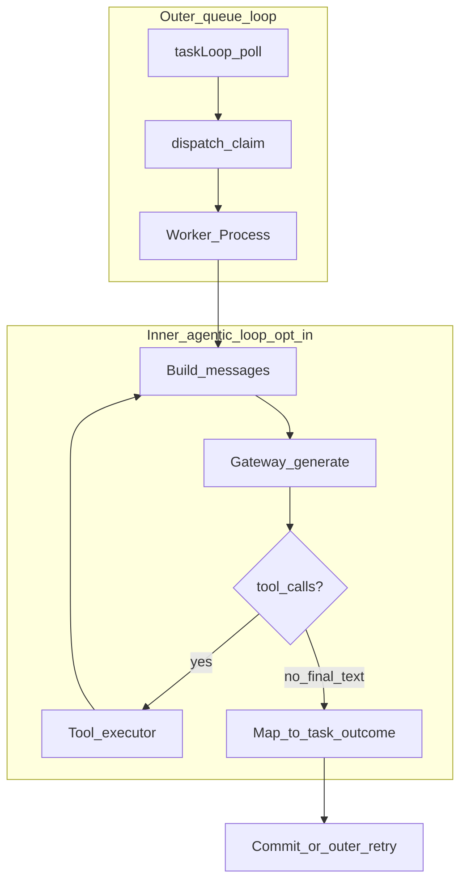

# Agentic harness architecture (agentd)

This document describes the **inner agentic loop** pattern agentd is moving toward, how it maps onto the codebase today, and how it differs from the **current worker contract** (single LLM call, structured JSON, then sandbox).

## Inner agentic loop (target behavior)

An inner agentic loop is a **per-task** cycle that:

1. Calls the LLM with a message list and tool definitions (`tools` in the chat-completions sense).
2. If the assistant message includes `tool_calls`, executes those tools and appends `role: tool` messages (with `tool_call_id`) to the history.
3. Calls the LLM again with the updated history.
4. Stops when the assistant returns **final text** without further tool calls (or when safety limits fire).

A minimal tool surface for coding agents is often three tools: `bash`, `read`, and `write`, plus a message array and a bounded loop around the gateway call.

```text
[system, user, …] → LLM → tool_calls? → execute → [tool messages] → LLM → … → final text
```



## Outer loop vs inner loop

| Layer | Responsibility | Where it lives |
| --- | --- | --- |
| **Outer loop** | Poll the store, claim ready work, run one worker invocation per claimed task, then commit, retry, heal, or hand off. | [`internal/queue/daemon.go`](../internal/queue/daemon.go) starts `taskLoop`; [`internal/queue/loop.go`](../internal/queue/loop.go) implements `taskLoop`, `dispatch`, and related intake behavior. |
| **Inner loop** | Multiple gateway round-trips **inside** a single task, accumulating assistant and tool messages until a final text response. | **Not implemented yet**; entry point remains [`Worker.Process`](../internal/queue/worker/worker.go) in [`internal/queue/worker/`](../internal/queue/worker/). |

Outer retry/healing/handoff must continue to wrap the **whole** inner loop as one logical attempt (or one explicitly designed unit of work), not each tool invocation. A tool error should be returned to the model as tool output unless policy says otherwise; it should not automatically trigger the same outer path as a sandbox failure on the legacy single command.

## Two LLM contracts

### Current (default worker): structured JSON, one shot

- Messages are built in [`worker_support.go`](../internal/queue/worker/worker_support.go) (`workerMessages`) from `AgentProfile` and the task.
- The worker calls the gateway with JSON mode and decodes a **`workerResponse`**: `command`, or `too_complex` with `subtasks`, via `GenerateJSON` in [`worker.go`](../internal/queue/worker/worker.go).
- Exactly **one** LLM generation per attempt drives **one** sandbox execution for the shell command path.

### Target (opt-in agentic mode): native tool calling

- Requests include **`tools`** (JSON schemas). Responses can include **`tool_calls`** on the assistant message.
- The worker appends assistant messages (including `tool_calls`) and tool result messages, then calls the gateway again until there are no more tool calls.
- **Task completion semantics** (for implementers): define explicitly how final assistant text maps to task success—for example, treat non-empty final text as a summary that closes the task, or require a small structured tail (JSON) in the last message for `command`/status. The roadmap and task prompts assume this is decided in the orchestration task so the state machine and events stay consistent.

## How concepts map in agentd today

### Tools

| Concept | agentd today |
| --- | --- |
| Shell execution | [`internal/sandbox/executor.go`](../internal/sandbox/executor.go) — `BashExecutor.Execute()` with sudo blocking, path jailing, ulimits, scrubbing, inactivity timeout. |
| Read/write as **LLM-invokable** tools | Not exposed; only the legacy JSON `command` path drives the sandbox. |

### Tool definitions and parsing

| Concept | agentd today |
| --- | --- |
| `tools` on API requests | Not wired; see [`internal/gateway/spec/spec.go`](../internal/gateway/spec/spec.go) (`AIRequest` has no tools field). |
| `tool_calls` on responses | Not parsed; [`AIResponse`](../internal/gateway/spec/spec.go) is content-oriented only. OpenAI provider types live in [`internal/gateway/providers/openai.go`](../internal/gateway/providers/openai.go). |

### Messages and history

| Concept | agentd today |
| --- | --- |
| Per-task messages | Built per invocation; [`PromptMessage`](../internal/gateway/spec/spec.go) is `role` + `content` only (no `tool_calls` / `tool_call_id`). |
| Tool results in the model context | Sandbox stdout/stderr become task result and **events**, not a follow-up chat message. Retry context uses `ExecutionPayload.PreviousAttempts`, not full chat history. |
| Event stream | Persisted event types include `LOG`, `RESULT`, `FAILURE`, etc. — see [`internal/models/enums.go`](../internal/models/enums.go); no first-class tool-call events until the backlog item that adds them. |

### Client / input surface

| Concept | agentd today |
| --- | --- |
| Chat HTTP API | OpenAI-compatible handlers under [`internal/api/controllers/`](../internal/api/controllers/) (e.g. chat completions). |

## Production capabilities that already exist

These support the outer system and will **wrap** the inner loop once it exists:

- Multi-provider routing with fallback and circuit breaking.
- Task breakdown, parameter tuning on retry, human handoffs.
- Hardened sandbox, concurrent workers, persistent kanban state, memory subsystem, intent classification, token budgets, truncation strategies, and scheduled daemon loops.

## Related files

| Path | Role |
| --- | --- |
| [`internal/gateway/spec/spec.go`](../internal/gateway/spec/spec.go) | `AIRequest`, `AIResponse`, `PromptMessage`, truncation and budget interfaces. |
| [`internal/gateway/providers/openai.go`](../internal/gateway/providers/openai.go) | OpenAI HTTP request/response shapes. |
| [`internal/queue/worker/worker.go`](../internal/queue/worker/worker.go) | `Process`, gateway calls, sandbox orchestration. |
| [`internal/queue/worker/worker_support.go`](../internal/queue/worker/worker_support.go) | `workerResponse`, `workerMessages`, payload helpers. |
| [`internal/queue/worker/worker_payloads.go`](../internal/queue/worker/worker_payloads.go) | Result/failure/prompt payload formatting for events. |
| [`internal/queue/worker/worker_retry.go`](../internal/queue/worker/worker_retry.go) | Retry and healing. |
| [`internal/queue/worker/worker_handoffs.go`](../internal/queue/worker/worker_handoffs.go) | Handoff creation. |
| [`internal/queue/daemon.go`](../internal/queue/daemon.go) | Daemon lifecycle; starts outer loops. |
| [`internal/queue/loop.go`](../internal/queue/loop.go) | `taskLoop`, `dispatch`. |
| [`internal/sandbox/`](../internal/sandbox/) | Execution, adapters, safety limits. |

## See also

- [docs/agentic-harness-roadmap.md](agentic-harness-roadmap.md) — Phased implementation roadmap and links to task prompts.
- [tasks/](../tasks/) — Dependency-ordered implementation prompts (`01`–`12`).
