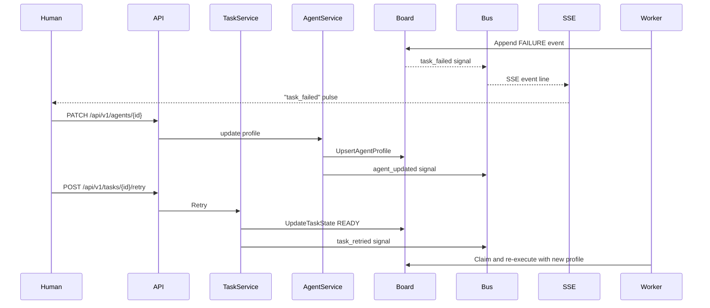
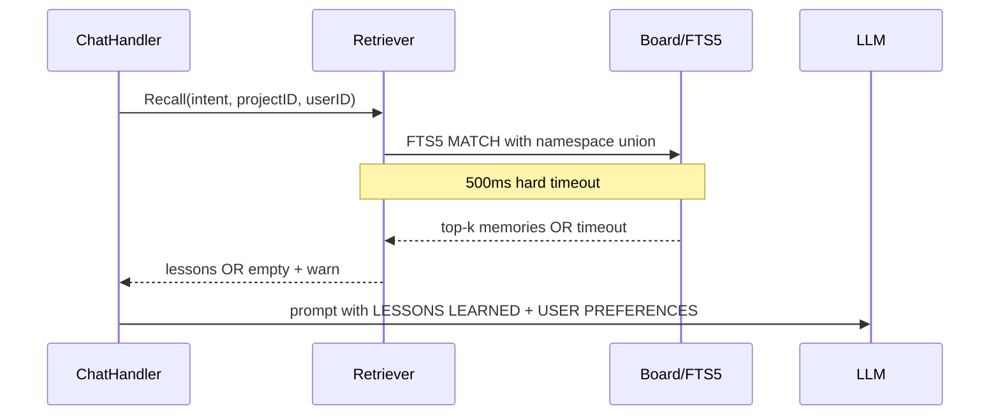

# agentd Architecture Flows (Extended)

This document contains the extended architecture flows split from `architecture.md` to keep each tracked file below the repository LOC cap.

### Flow 5. Manager's Loop (Live Cockpit)

The manager's loop closes the gap between worker failure and human reaction. The cockpit listens on `GET /api/v1/events/stream` (optionally narrowed by `?task_id=` or `?project_id=`); when a `task_failed` named event arrives, the operator can `PATCH` the responsible `AgentProfile` (e.g., switch provider, raise `max_tokens`, edit `system_prompt`), `POST /assign` to a different agent, `POST /split` to break the work into subtasks, or `POST /retry` to send the task back to `READY`. Worker dispatch then forwards the (possibly new) `profile.Provider`, `profile.Model`, `profile.MaxTokens`, and `profile.Temperature` into `gateway.AIRequest`, where the router precedence is explicit profile values > role routing > first configured provider.

### Flow 6. Memory Recall

The recall flow pre-fetches durable memories before any LLM call. The Retriever enforces a 500ms hard timeout so the system proceeds without context rather than blocking (Danger B). Namespace isolation ensures only GLOBAL, current-project, and matching user-preference memories are returned (Danger D). After recall, access counts are bumped asynchronously. The Dream Agent runs nightly to consolidate redundant memories and resolve contradictions (Danger C).

**Failure Analysis:**

- **Risk:** A `RUNNING` task remains stuck after a process dies.
- **Mitigation:** Reconcile DB PIDs against OS PIDs repeatedly, not just at startup, and update task heartbeats while work is alive.
- **Status today:** Mitigated. Workers update `last_heartbeat` periodically, and the daemon's heartbeat reconciliation loop resets tasks whose PID is missing or whose heartbeat exceeds `heartbeat.stale_after`.

- **Risk:** Disk usage grows until the daemon fails.
- **Mitigation:** A cron-driven disk monitor should create a HUMAN board task before free space becomes critical.
- **Status today:** Mitigated. The `disk-watchdog` cron job in [`internal/queue/disk_watchdog.go`](../internal/queue/disk_watchdog.go) creates a de-duplicated HUMAN task under `_system` when free space falls below `disk.free_threshold_percent`.

- **Risk:** The Librarian deletes raw logs before memory ingestion commits.
- **Mitigation:** Use two-phase archival: archive raw logs, insert memory, soft-delete events, and delete the archive only after a grace period.
- **Status today:** Mitigated. [`internal/memory/librarian.go`](../internal/memory/librarian.go) follows Archive -> RecordMemory -> MarkEventsCurated safety order, and [`internal/memory/archiver.go`](../internal/memory/archiver.go) cleans stale archives only after `librarian.archive_grace_days`.
