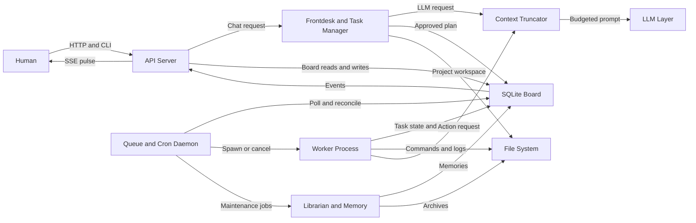
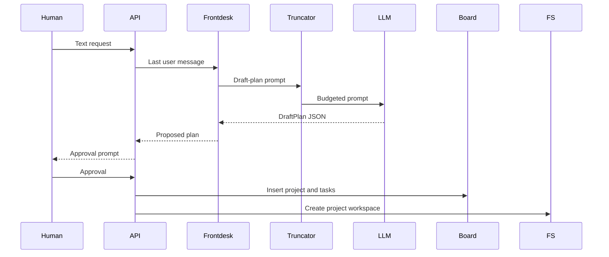
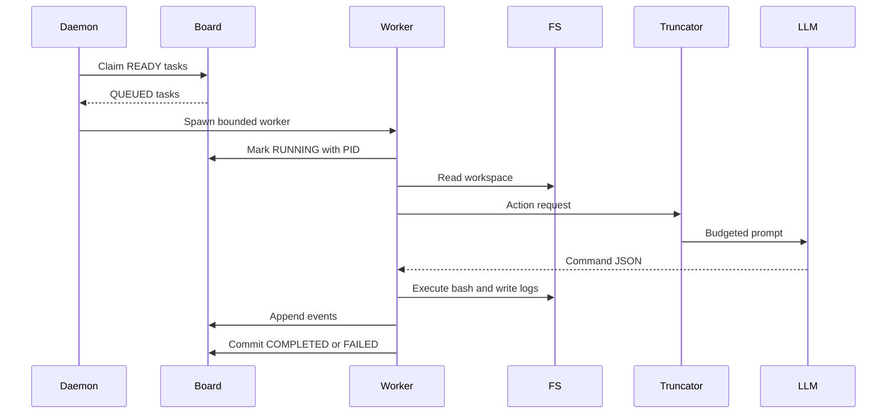
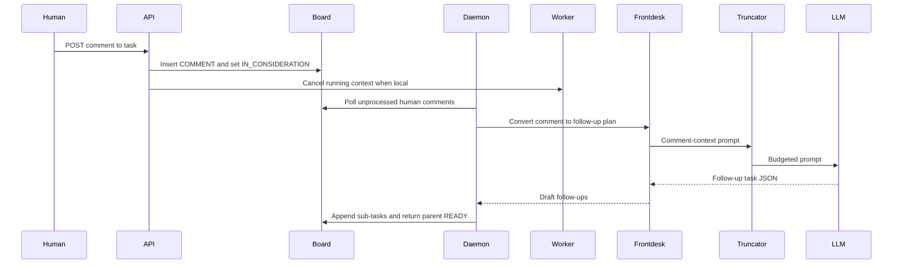
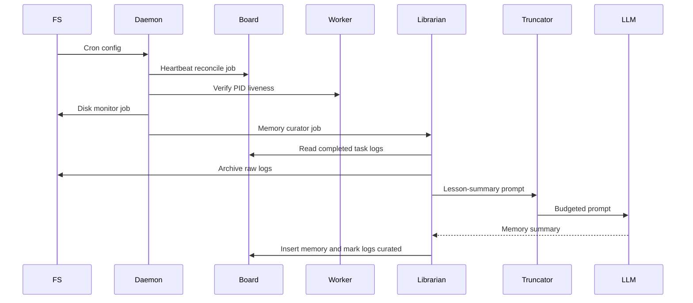

# agentd Architecture

This document maps the long-lived system nodes, data flows, failure points, and invariants for `agentd`. It describes the intended architecture without tying it to short-lived implementation delta IDs.

For the foundational implementation baseline, see the Phase 1 contract in [`docs/phase1-skeleton.md`](phase1-skeleton.md).

## System Nodes

### Human

- **Today:** The human interacts through `agentd ask`, `agentd comment`, REST `POST /api/v1/projects/materialize`, and REST `POST /api/v1/tasks/{id}/comments`. Optional `api.materialize_token` requires matching header `X-Agentd-Materialize-Token` on materialize so API clients cannot skip the CLI approval loop without the shared secret.
- **Spec role:** The human writes intent, approvals, comments, and board state changes. The human does not directly pipe input into a running worker.

### API Server (Go)

- **Today:** HTTP routing lives in [`internal/api/server/server.go`](../internal/api/server/server.go) (re-exported from [`internal/api/exports.go`](../internal/api/exports.go)), controllers live under [`internal/api/controllers`](../internal/api/controllers), and SSE lives under [`internal/api/sse`](../internal/api/sse).
- **Spec role:** The API server is the single entry point for humans and clients. It owns routing, request validation, HTTP timeouts, and live event streaming.

### Frontdesk / Task Manager

- **Today:** Chat planning starts in [`internal/api/controllers/chat.go`](../internal/api/controllers/chat.go), while approved plan materialization is mediated by [`internal/services/project_service.go`](../internal/services/project_service.go). The shared HTTP envelope, error mapping, and validation helpers live in [`internal/api/httpx`](../internal/api/httpx) and are consumed by both `internal/api` and `internal/api/controllers` to avoid an import cycle.
- **Spec role:** Frontdesk shields the system from vague requests (including an `out_of_scope` intent that yields `feasibility_clarification` JSON), classifies intent, plans small phases, asks for approval, and turns approved plans into board records. When the SQLite `house_rules` setting is present, planning calls prepend it via the gateway context (see [`internal/models/settings_keys.go`](../internal/models/settings_keys.go) and [`internal/gateway/routing/house_rules.go`](../internal/gateway/routing/house_rules.go), re-exported from the `gateway` package).

### Service Layer (`internal/services`)

- **Today:** [`internal/services/project_service.go`](../internal/services/project_service.go) materializes approved plans and provisions workspaces, [`internal/services/task_service.go`](../internal/services/task_service.go) translates HTTP-shaped task operations (human comments, state patches, paginated listings) into store calls, and [`internal/services/system_service.go`](../internal/services/system_service.go) composes deterministic status with optional breaker and runtime memory probes for `GET /api/v1/system/status`.
- **Spec role:** Services own business orchestration between controllers and the persistence layer. They never enforce state guards in Go (those live inside SQL transactions) and they never directly cancel workers (the store's `models.TaskCanceller` hook fires after commit, per Invariant #4).

### The Board (SQLite)

- **Today:** The durable schema lives in [`internal/kanban/db/schema.sql`](../internal/kanban/db/schema.sql), and the store boundary is implemented by [`internal/kanban/store.go`](../internal/kanban/store.go).
- **Spec role:** SQLite is the source of truth for projects, tasks, task states, comments, events, settings, profiles, and memories.

**Task states:** In addition to the product-facing lifecycle (`PENDING`, `READY`, `RUNNING`, `BLOCKED`, `COMPLETED`, `FAILED`, `IN_CONSIDERATION`), the schema includes `QUEUED` (claimed by the daemon, not yet executing) and `FAILED_REQUIRES_HUMAN` (terminal state for cases that need operator intervention). See [`internal/kanban/db/schema.sql`](../internal/kanban/db/schema.sql) and [`internal/models/enums.go`](../internal/models/enums.go).

### Queue & Cron Daemon

- **Today:** Daemon startup and loops live in [`internal/queue/daemon.go`](../internal/queue/daemon.go) and [`internal/queue/loop.go`](../internal/queue/loop.go); worker limits are controlled by [`internal/queue/safety/semaphore.go`](../internal/queue/safety/semaphore.go); LLM outage gating lives in [`internal/queue/safety/breaker.go`](../internal/queue/safety/breaker.go). Each dispatched goroutine is wrapped with `context.WithTimeout(queue.task_deadline)` (default 10 min) for wall-clock timeout enforcement, and polling uses adaptive backoff (doubles up to `queue.poll_max_interval` when idle, resets on claim).
- **Spec role:** The daemon is the heartbeat. It polls the board, respects configured concurrency, starts workers, cancels workers, reconciles PIDs, and runs maintenance jobs. Maintenance components (disk watchdog, memory curator) are invoked in-process; routing them through `_system` Kanban tasks is a roadmap item.

### Worker Process

- **Today:** Task processing lives in [`internal/queue/worker/worker.go`](../internal/queue/worker/worker.go), while command execution is isolated by [`internal/sandbox/executor.go`](../internal/sandbox/executor.go). The worker attaches SQLite `house_rules` (same key as Frontdesk) into the LLM gateway context before action JSON is generated.
- **Spec role:** A worker is an isolated task runner. It reads a task from the board, asks the LLM for a bounded action, executes in the workspace, streams logs, and commits task outcome through SQLite.

### Context Truncator

- **Today:** The structural truncation point is `applyTruncation` inside [`internal/gateway/routing/router.go`](../internal/gateway/routing/router.go), using strategies from [`internal/gateway/truncation/truncate.go`](../internal/gateway/truncation/truncate.go).
- **Spec role:** Every outbound LLM request must cross this node. It enforces input budgets and decides whether to truncate, summarize, or reject oversized data.

### LLM Layer

- **Today:** OpenAI, Anthropic, Ollama, and AI Horde providers live in [`internal/gateway/providers/`](../internal/gateway/providers/); wire types live in [`internal/gateway/spec/spec.go`](../internal/gateway/spec/spec.go) and are re-exported from [`internal/gateway/exports.go`](../internal/gateway/exports.go). Per-task token budget enforcement lives in [`internal/gateway/budget.go`](../internal/gateway/budget.go). Role-based routing is configured via `Router.WithRoleRouting` ([`internal/gateway/routing/router.go`](../internal/gateway/routing/router.go)).
- **Spec role:** The LLM layer is raw compute. It should not own orchestration, state, retries, file access, or task lifecycle decisions.

### File System

- **Today:** Workspace paths are managed in [`internal/sandbox/workspace.go`](../internal/sandbox/workspace.go), and home/project paths are resolved in [`internal/config/config.go`](../internal/config/config.go).
- **Spec role:** Disk holds workspaces, config files, archives, and raw logs. Workers must stay inside their assigned workspace.

### Librarian / Memory

- **Today:** [`internal/memory/librarian.go`](../internal/memory/librarian.go) implements chunked map-reduce summarization of completed task logs into durable `{symptom, solution}` memories. Archives are written by [`internal/memory/archiver.go`](../internal/memory/archiver.go), and the `memory-curator` cron job drives the pipeline. [`internal/memory/recall.go`](../internal/memory/recall.go) provides FTS5-based recall with 500ms hard timeouts, namespace isolation (GLOBAL + current project + user preferences), and access-count tracking. [`internal/memory/dream.go`](../internal/memory/dream.go) implements the Dream Agent for nightly consolidation of redundant memories via LLM merge. User preferences are stored as `USER_PREFERENCE`-scoped memories and injected into chat prompts.
- **Spec role:** The Librarian curates completed task logs into durable lessons, archives raw artifacts, recalls relevant context before LLM calls, consolidates redundant knowledge, and helps future workers avoid repeated mistakes.

## Data Flows

### Flow 1. Intake & Planning

The intake flow turns vague human intent into approved board work. The Frontdesk is responsible for keeping this flow narrow enough to fit model and review limits.

**Failure Analysis:**

- **Risk:** The LLM returns malformed JSON instead of a valid task array.
- **Mitigation:** [`internal/gateway/correction/correction.go`](../internal/gateway/correction/correction.go) uses `GenerateJSON` with `maxJSONAttempts = 3` and adds corrective prompts after invalid JSON.
- **Status today:** Mitigated. Strict parsing, retries, and corrective prompts exist in [`internal/gateway/correction/correction.go`](../internal/gateway/correction/correction.go).

- **Risk:** A large project produces too many tasks and the model cuts off the JSON mid-array.
- **Mitigation:** Frontdesk should cap each phase to a small task count and include a final follow-up planning task when more work remains.
- **Status today:** Mitigated. `gateway.max_tasks_per_phase` (default 7) caps plan output, and `EnforcePhaseCap` in [`internal/gateway/correction/correction.go`](../internal/gateway/correction/correction.go) deterministically trims oversized plans with a `Plan Phase N` continuation task.

### Flow 2. Execution Cycle

The execution cycle separates durable intent from active execution. SQLite records what should happen; the daemon and worker processes handle what is happening. The Board atomically transitions READY to QUEUED inside `ClaimNextReadyTasks`; the worker then transitions QUEUED to RUNNING via `MarkTaskRunning`. The circuit breaker trips to OPEN after `breaker.failure_threshold` consecutive **gateway-classified** LLM failures (default 3): only errors wrapping `models.ErrLLMUnreachable` or `models.ErrLLMQuotaExceeded` increment the breaker (see [`internal/queue/safety/breaker.go`](../internal/queue/safety/breaker.go)), not every HTTP 4xx/5xx from a provider. Each worker goroutine runs under a `queue.task_deadline` wall-clock timeout (default 10 min).

**Failure Analysis:**

- **Risk:** Bash hangs on an interactive prompt.
- **Mitigation:** [`internal/sandbox/executor.go`](../internal/sandbox/executor.go) closes stdin with `cmd.Stdin = strings.NewReader("")`, monitors output inactivity, and kills the process group on timeout.
- **Status today:** Mitigated. Hanging processes are killed, timed-out output is scanned for interactive prompt patterns by [`internal/queue/safety/prompt_detector.go`](../internal/queue/safety/prompt_detector.go), allowlisted commands get a non-interactive retry via [`internal/queue/recovery/prompt_recovery.go`](../internal/queue/recovery/prompt_recovery.go), and unrecoverable prompts create a HUMAN child task.

- **Risk:** The daemon dies while the board says a task is `RUNNING`.
- **Mitigation:** [`internal/queue/recovery/recover.go`](../internal/queue/recovery/recover.go) reconciles recorded PIDs against OS PIDs at startup.
- **Status today:** Mitigated. Boot reconciliation resets ghost tasks at startup, and a continuous heartbeat loop in [`internal/queue/loop.go`](../internal/queue/loop.go) reconciles `RUNNING` tasks against OS PIDs and `last_heartbeat` timestamps on the `heartbeat.stale_after` interval.

- **Risk:** The worker tries to read too much code or log data, overflowing context.
- **Mitigation:** The Context Truncator must reject or summarize excessive payloads, and the worker should split the task into smaller board tasks when needed.
- **Status today:** Mitigated. The truncator in [`internal/gateway/truncation/truncator.go`](../internal/gateway/truncation/truncator.go) supports `middle_out`, `head_tail`, `summarize`, and `reject` policies with per-provider budgets. Workers split oversized tasks via `BlockTaskWithSubtasks` when the LLM returns `{too_complex: true}`.

- **Risk:** A worker gets caught in a retry loop, sending millions of tokens to a paid API (Danger A: Silent Wallet Drain).
- **Mitigation:** The router enforces per-task token budgets via `BudgetTracker`. When accumulated usage reaches `gateway.budget.tokens_per_task`, further requests return `ErrBudgetExceeded` without contacting any provider.
- **Status today:** Mitigated. [`internal/gateway/budget.go`](../internal/gateway/budget.go) implements `InMemoryBudgetTracker`, wired into `Router.generateOnce`. Workers set `TaskID` on every `AIRequest`.

- **Risk:** A slow local model (e.g., Ollama without GPU) takes 15 minutes, locking up the CPU even after the queue reaps the task (Danger C: Local Model Timeout).
- **Mitigation:** Each provider applies `cfg.Timeout` via `context.WithTimeout` before the HTTP round-trip. When the queue aborts the task, cancellation propagates and stops inference.
- **Status today:** Mitigated. All concrete providers under [`internal/gateway/providers/`](../internal/gateway/providers/) honor `cfg.Timeout`.

### Flow 3. Intervention & Delegation

The intervention flow keeps humans out of process pipes. Humans write comments to the board; workers and the daemon observe board state and react.

**Failure Analysis:**

- **Risk:** A human comments exactly as a worker finishes, and the worker marks the task `COMPLETED` before seeing the instruction.
- **Mitigation:** [`internal/kanban/events.go`](../internal/kanban/events.go) inserts the comment, sets `IN_CONSIDERATION`, and bumps `tasks.updated_at` in one transaction. [`internal/kanban/task_updates.go`](../internal/kanban/task_updates.go) commits results with `UPDATE tasks ... WHERE id = ? AND updated_at = ? AND state = ?`, so the worker's stale completion write fails with `ErrStateConflict`.
- **Status today:** Mitigated by optimistic locking and state transition checks.

- **Risk:** A long comment thread bloats worker context.
- **Mitigation:** Comment intake should summarize older comments into the task description before re-invoking Frontdesk or workers.
- **Status today:** Mitigated. Comment intake in [`internal/queue/intake.go`](../internal/queue/intake.go) summarizes older comment-thread context when it exceeds half the truncator budget before re-invoking Frontdesk.

- **Risk:** Cancellation cannot reach a running sandbox process.
- **Mitigation:** [`internal/queue/worker/canceller.go`](../internal/queue/worker/canceller.go) cancels the worker context when the worker is local, and the sandbox kills the process group when context cancellation reaches command execution.
- **Status today:** Partly mitigated. In-process cancellation exists; cross-process or remote worker cancellation would need a durable signal path.

### Flow 4. Background Maintenance

Background maintenance keeps the board aligned with the host, avoids disk bloat, and turns raw logs into useful lessons.

### Flow 5 and Flow 6 (Extended)

The detailed Manager's Loop and Memory Recall flows were moved to [`docs/architecture-flows.md`](architecture-flows.md) to keep this top-level architecture map concise and under repository LOC guardrails.

## Architectural Invariants

1. **The Context Truncator middleware is mandatory.** Every outbound LLM request should pass through a single budget-enforcement node. Today this is structurally enforced by [`Router.generateOnce`](../internal/gateway/routing/router.go) calling `applyTruncation` before provider calls.

2. **State and process are separate.** SQLite holds intent and lifecycle state; the daemon and workers hold transient execution. Today this is enforced by optimistic locks such as `UPDATE ... WHERE updated_at = ?`, plus `os_process_id` reconciliation at daemon start.

3. **File system boundaries are strict.** Workers must not operate outside their assigned workspace. Today this is enforced by `JailPath` and `looksLikeDirectoryEscape` in [`internal/sandbox/executor.go`](../internal/sandbox/executor.go).

4. **There are no direct human-to-agent pipes.** Humans write to SQLite through API calls; agents read from SQLite and react. Today this is enforced by the comment API, the `IN_CONSIDERATION` state, and the queue comment-intake loop.

5. **Per-task token budgets prevent runaway costs.** Every `Router.generateOnce` call checks `BudgetTracker.Reserve(taskID)` before contacting any provider. After a successful call, consumed tokens are recorded via `BudgetTracker.Add`. When accumulated usage exceeds `gateway.budget.tokens_per_task`, the router returns `ErrBudgetExceeded` without touching the network (Danger A: Silent Wallet Drain). Today this is enforced by [`internal/gateway/budget.go`](../internal/gateway/budget.go) wired into [`internal/gateway/routing/router.go`](../internal/gateway/routing/router.go).

6. **Role-based routing optimizes speed vs. intelligence.** Each `AIRequest` carries a `Role` (`chat`, `worker`, `memory`). When `gateway.role_models` is configured, `Router.applyRoleRouting` injects the preferred `Provider` and `Model` overrides so chat/planning uses high-reasoning models, workers use fast coding models, and memory summarization uses cheap models (Flow 6.3). If the caller already sets an explicit `Provider`, the role mapping is bypassed. Today this is enforced by [`internal/gateway/routing/router.go`](../internal/gateway/routing/router.go) and role annotations in [`internal/queue/worker/worker.go`](../internal/queue/worker/worker.go), [`internal/gateway/correction/correction.go`](../internal/gateway/correction/correction.go), [`internal/gateway/routing/intent.go`](../internal/gateway/routing/intent.go), [`internal/gateway/routing/scope.go`](../internal/gateway/routing/scope.go), and [`internal/memory/librarian.go`](../internal/memory/librarian.go).

7. **Cascade exhaustion wraps `ErrLLMUnreachable`.** When all configured providers fail, `Router.generateOnce` returns `fmt.Errorf("%w: ...", models.ErrLLMUnreachable)` so the circuit breaker in [`internal/queue/safety/breaker.go`](../internal/queue/safety/breaker.go) can recognize the error consistently via `errors.Is`.

8. **Provider-level timeouts prevent resource hogging.** Each provider (`OpenAI`, `Anthropic`, `Ollama`, `Horde`) applies `cfg.Timeout` via `context.WithTimeout` before the HTTP round-trip, so cancellation propagates and slow local models do not lock up the CPU indefinitely (Danger C: Local Model Timeout).

## Architectural Conventions

9. **The `_system` project is the durable home for operator-level tasks.** Outage alerts, disk alerts, and reboot recovery reviews are attached to a well-known `_system` project created by [`internal/kanban/system_project.go`](../internal/kanban/system_project.go). De-duplication via `EnsureProjectTask` prevents repeated open tasks from the same alert source.

10. **HUMAN child tasks under BLOCKED parents.** When the worker detects a condition requiring human action (interactive prompt, permission failure, provider exhaustion, healing failure), it blocks the parent task and creates a HUMAN-assigned child task. The parent automatically returns to `READY` after all children complete, so the original work resumes without re-creation.

11. **Config precedence.** CLI flags such as `--home` and `--workers` are highest for their own values. For config keys: explicit `--config <file>` > `AGENTD_*` environment variables > auto-discovered `<home>/config.yaml` > compiled defaults. Source: [`internal/config/config.go`](../internal/config/config.go) and [`internal/config/override.go`](../internal/config/override.go).
