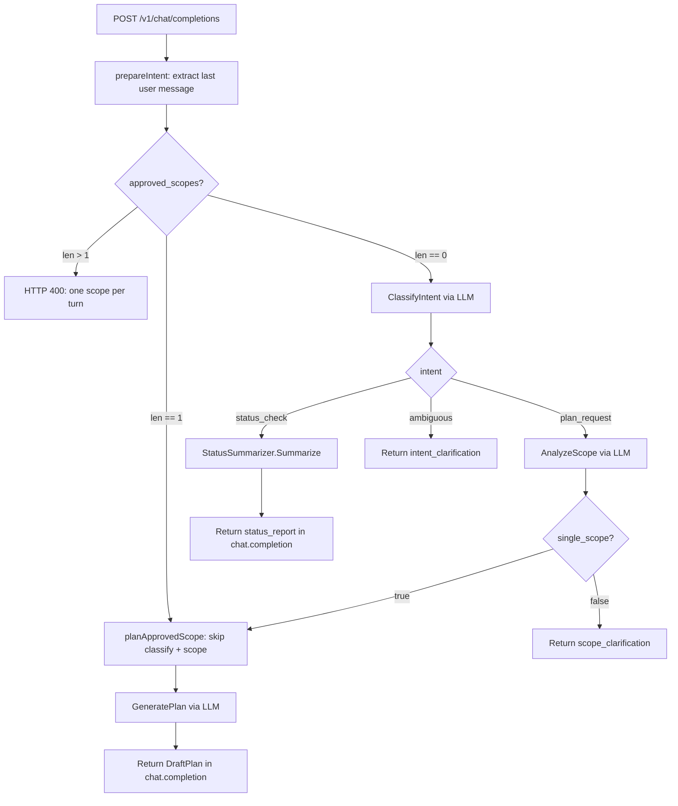
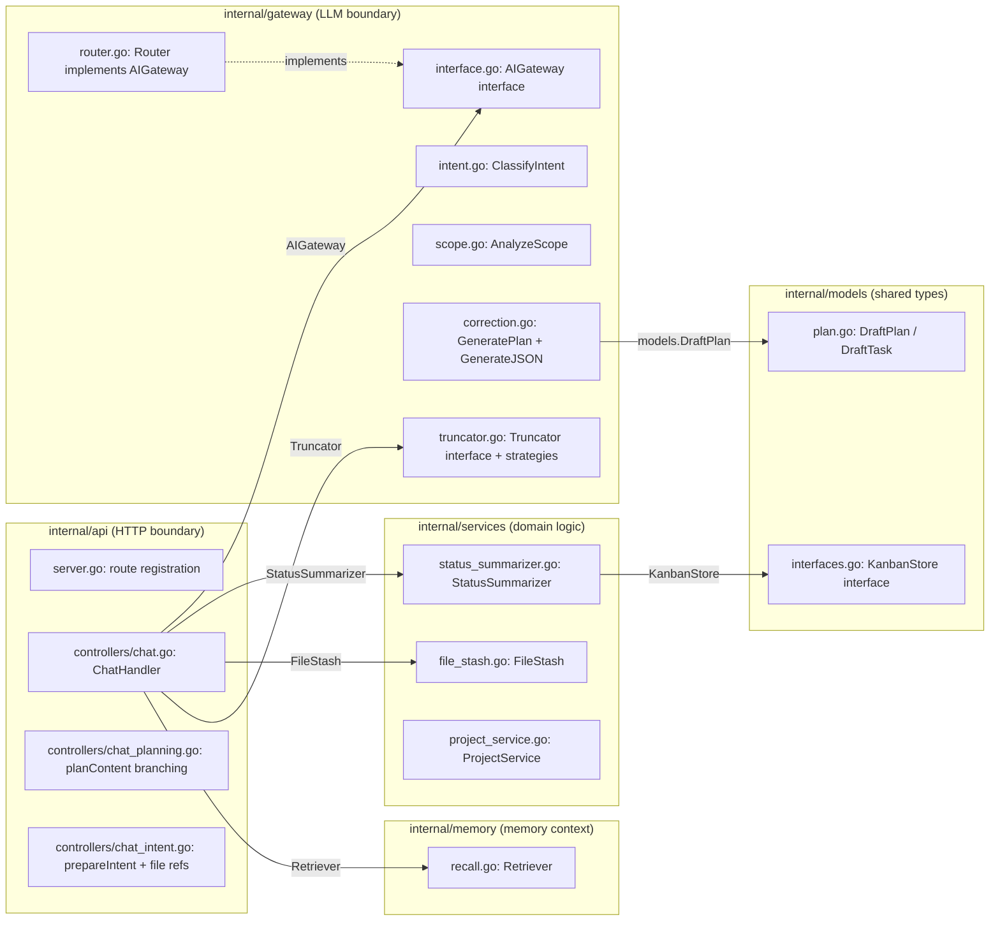

# Frontdesk Architecture

The Frontdesk is the chat-facing subsystem of agentd -- a **stateless request router** that takes unstructured human text and converts it into a strictly structured JSON payload that the Kanban Board can understand. Each HTTP request is self-contained; the server holds no session state between calls. The client is responsible for managing conversation context and presenting plans for approval.

## Decision Flow



## Code Boundaries

The Frontdesk spans three Go packages. Each package owns one concern and communicates with the others through interfaces, never through direct struct access.



### Package responsibilities

| Package | Owns | Does NOT own |
|---------|------|-------------|
| `internal/api/controllers` | HTTP decode/encode, request routing, error mapping, response envelope formatting | LLM prompts, JSON retry logic, truncation strategies, board persistence |
| `internal/gateway` | LLM prompt construction, provider fallback, JSON self-correction, truncation enforcement, intent/scope system prompts | HTTP transport, board reads/writes, file stashing |
| `internal/services` | Deterministic status aggregation, file stash I/O, plan materialization orchestration | LLM calls, HTTP routing |
| `internal/models` | Shared domain types (`DraftPlan`, `DraftTask`, `KanbanStore` interface, `TaskState` enum) | Any behavior; pure data definitions |

### Interface seams

The Frontdesk's testability comes from two interface boundaries:

1. **`gateway.AIGateway`** ([`internal/gateway/spec/spec.go`](../internal/gateway/spec/spec.go), re-exported from [`internal/gateway/exports.go`](../internal/gateway/exports.go)) -- the `ChatHandler` depends on this interface, not on `Router` directly. Tests inject `apiGateway` with scripted returns and call counters.

2. **`models.KanbanStore`** ([`internal/models/interfaces.go`](../internal/models/interfaces.go)) -- `StatusSummarizer` and `ProjectService` depend on this interface. Tests inject `apiStore` (minimal in-memory state) or `FakeKanbanStore` (full fake in `internal/testutil/`).

The `Truncator` interface ([`internal/gateway/truncation/truncator.go`](../internal/gateway/truncation/truncator.go), re-exported from `gateway`) is a third seam used by file-handling tests, injected via `ServerDeps.Truncator`.

### Wiring

All dependencies are assembled in [`cmd/agentd/wiring.go`](../cmd/agentd/wiring.go) (`newRuntimeDeps`) and [`cmd/agentd/start.go`](../cmd/agentd/start.go) (`openRuntime`). The `ChatHandler` struct is constructed via [`internal/api/server/server.go`](../internal/api/server/server.go) (see [`internal/api/exports.go`](../internal/api/exports.go)) from `ServerDeps`:

```go
chat := controllers.ChatHandler{
    Gateway: deps.Gateway, Summarizer: deps.Summarizer, FileStash: deps.FileStash,
    Truncator: deps.Truncator, TruncationBudget: deps.Budget,
}
```

## Key Types

| Role | Actual Type | Package | Notes |
|------|-------------|---------|-------|
| Chat controller | `ChatHandler` | `internal/api/controllers` | Holds `AIGateway`, `StatusSummarizer`, `FileStash`, `Truncator`, `Retriever` |
| Gateway facade | `Router` | `internal/gateway/routing` (re-exported) | Implements `AIGateway` with provider fallback and truncation |
| Intent classifier | `Router.ClassifyIntent` | `internal/gateway/routing` | Returns `IntentAnalysis{Intent, Reason}` |
| Scope analyzer | `Router.AnalyzeScope` | `internal/gateway/routing` | Returns `ScopeAnalysis{SingleScope, Confidence, Scopes, Reason}` |
| Plan generator | `Router.GeneratePlan` | `internal/gateway/routing` | Returns `*models.DraftPlan` via `GenerateJSON[DraftPlan]` |
| JSON repair | `GenerateJSON[T]` | `internal/gateway/correction` (re-exported) | Generic function; retries with corrective prompts |
| Status reporter | `StatusSummarizer` | `internal/services` | Deterministic; queries `KanbanStore` only, no LLM calls |
| Plan model | `DraftPlan` / `DraftTask` | `internal/models` | Frontdesk output awaiting human approval |

## Specifications

Behavior is defined and verified through Gherkin BDD scenarios (run via Godog) and Go unit tests. See [`reference.md`](reference.md) for the full feature catalog.

| Concern | Feature File |
|---------|-------------|
| Intake decision tree (intent classification, scope shield, status check, ambiguous) | [`openai_intake.feature`](../internal/api/features/openai_intake.feature) |
| CLI draft-and-approve loop | [`cli_ask.feature`](../cmd/agentd/features/cli_ask.feature) |
| Timeout resilience | [`chat_timeout.feature`](../internal/api/features/chat_timeout.feature) |
| File stash and truncation passthrough | [`chat_file_handling.feature`](../internal/api/features/chat_file_handling.feature) |
| JSON self-correction | [`json_strictness_auto_correction.feature`](../internal/gateway/features/json_strictness_auto_correction.feature) |
| Truncation policies | [`truncation_strategies.feature`](../internal/gateway/features/truncation_strategies.feature) |
| Phase cap enforcement | [`plan_phase_cap.feature`](../internal/gateway/features/plan_phase_cap.feature) |
| Plan materialization and dependency validation | [`project_materialization.feature`](../internal/kanban/features/project_materialization.feature) |
| Memory recall namespace isolation | [`recall_namespace.feature`](../internal/memory/features/recall_namespace.feature) |
| Memory recall timeout fallback | [`recall_timeout.feature`](../internal/memory/features/recall_timeout.feature) |
| User preferences | [`user_preferences.feature`](../internal/memory/features/user_preferences.feature) |
