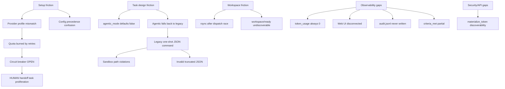

# Agentd smoke test — friction analysis (session post-mortem)

Report-only catalog of real-world frictions discovered during the folder-report smoke test (May 2026). Intended for another agent or engineer to read and reproduce failures — **no fixes are implemented here**.

## Session context

**Goal:** Materialize a single “folder structure report” task, seed workspace, wait for `COMPLETED`, audit metrics.

**Environment:**
- Repo: `/Users/irlagua/projects/agentd`
- Home: `~/.agentd` (pre-initialized)
- Provider: `GEMINI_API_KEY` only (no OpenAI/Anthropic/Ollama)
- Daemon: `./bin/agentd start -v` (later `--skip-llm-warmup` after quota hits)

**Outcome:** Daemon and API worked; projects materialized; workspace could be seeded manually; **zero tasks reached `COMPLETED`**. Primary tasks ended `BLOCKED` with HUMAN handoff children. `token_usage` stayed 0 everywhere. `REPORT.md` only existed after manual shell fallback.

**Session footguns:** The minimal repro below PATCHes `provider: gemini` (disables gateway cascade — see F7) and `agentic_mode: true` (required because seeded profiles default to legacy mode — see F20).

---

## Friction map



---

## Friction catalog

### F1 — Seeded agent profiles vs actual API keys

| | |
|---|---|
| **Symptom** | Worker errors like `LLM provider "openai" is not configured` unless profiles are PATCHed after init. |
| **Root cause** | **Stale `global.db` only.** Current [`cmd/agentd/profiles.go`](../cmd/agentd/profiles.go) `defaultAgentProfiles()` seeds all three profiles with `Provider: ""` (empty → gateway cascade). On a database created by an older build, rows may still carry a hard-coded `openai`/`anthropic` provider value. Worker forwards `profile.Provider` into gateway requests ([`internal/gateway/routing/router.go`](../internal/gateway/routing/router.go) L165–167) — an explicit non-empty provider **does not cascade** to the next entry in `gateway.order`. |
| **Reproduce** | Use a `~/.agentd/global.db` created before the empty-provider change. `agentd init` with only `GEMINI_API_KEY`; do not pass `--reset-profiles`. Materialize task. Observe failures referencing openai/anthropic. |
| **Workaround today** | Run `agentd init --reset-profiles` to overwrite stale profile rows with empty provider. OR `PATCH /api/v1/agents/default` with `{"provider":"gemini","model":"gemini-2.5-flash"}`. |

---

### F2 — Config precedence: `.env` overrides `~/.agentd/config.yaml`

| | |
|---|---|
| **Symptom** | Edits to `~/.agentd/config.yaml` (e.g. `order: [horde]`) appear ignored; startup logs still show `provider: gemini`. |
| **Root cause** | Precedence: CLI > explicit config file > **`AGENTD_*` env** > auto-discovered config ([README](../README.md), [config.reference.yaml](../config.reference.yaml)). Repo `.env` may set `AGENTD_GATEWAY_ORDER=gemini`. |
| **Reproduce** | 1. Write `gateway.order: [horde]` in `~/.agentd/config.yaml`. 2. Keep `AGENTD_GATEWAY_ORDER=gemini` in repo `.env`. 3. Start from repo dir. 4. Check debug log: `LLM provider check complete provider=gemini`. |
| **Workaround today** | Align `.env` and `config.yaml`, or start with `--config` and no conflicting env vars. |

---

### F3 — `agentic_mode: true` on some providers is a silent downgrade

| | |
|---|---|
| **Symptom** | Daemon log: `agentic mode requested but routed provider does not support tool round-tripping; falling back to legacy mode`. Plan expects tool loop; actual path is legacy JSON command. |
| **Root cause** | **Capability gate** in [`internal/gateway/providers/provider.go`](../internal/gateway/providers/provider.go) `capabilitiesFromConfig`. Providers using the **Horde, Ollama, or llamacpp** adapters return `SupportsChatTools: false` by default. Ollama and llamacpp are common local-model setups where the silent downgrade is easy to miss. Gemini maps to the OpenAI adapter via `canonicalAdapter()` and therefore returns `SupportsChatTools: true` — the fallback should **not** trigger for standard Gemini config. [`worker_support.go`](../internal/queue/worker/worker_support.go) L203–205 calls `ProviderSupportsChatTools(profile.Provider)`; [`worker_agentic.go`](../internal/queue/worker/worker_agentic.go) L30–36 falls back to `runLegacyTask` when false. **Note:** the fallback observed during this session with Gemini has an uncertain root cause — quota exhaustion (F6) tripped the breaker before the capability check ran; the log message may have been misleading. |
| **Reproduce** | Configure Ollama, llamacpp, or Horde as the provider. `PATCH` agent with `"agentic_mode": true`. Materialize any SYSTEM task. Tail daemon logs for WARN above. |
| **Impact** | Agentic mode silently disabled for Ollama/Horde/llamacpp setups; audit log may not activate (see F12). |
| **Workaround today** | Override per provider via `capabilities.chat_tools: true` in config when the model supports tool calling (see [`docs/provider-tool-calling.md`](provider-tool-calling.md)). Or use OpenAI/Anthropic/Gemini for agentic tasks. |

---

### F4 — Legacy worker = one shell command JSON (poor fit for “structured report”)

| | |
|---|---|
| **Symptom** | LLM returns `{"command":"echo ... huge markdown ..."}` → `invalid JSON response: unexpected end of JSON input`; or `too_complex` → task split → parent `BLOCKED`. |
| **Root cause** | [`worker_legacy.go`](../internal/queue/worker/worker_legacy.go): single `GenerateJSON` expecting `{"command":"..."}` or `{"too_complex":true,"subtasks":[...]}`. Default system prompt: “Output only JSON” + one safe shell command. |
| **Reproduce** | Gemini + legacy mode (F3 or F20). Materialize “Write REPORT.md with full structure”. Query events: `RETRY` with `gateway error: invalid JSON response`. |
| **Impact** | Smoke-test task design is incompatible with legacy mode unless description narrows to one simple shell command. |

---

### F5 — Sandbox workspace isolation + rsync timing race

| | |
|---|---|
| **Symptom** | Worker runs against empty workspace, or LLM emits `/Users/.../agentd/<project-uuid>` → `sandbox path violation: ... escapes ~/.agentd/projects`. |
| **Root cause** | Workspace is `~/.agentd/projects/<project-id>/` ([`internal/sandbox/workspace.go`](../internal/sandbox/workspace.go) `JailPath`). **Default daemon (`ProjectService` wired):** without `source_path`, root tasks start `PENDING` and stay unclaimable until `POST /api/v1/projects/{id}/workspace/ready` (F17) — no dispatch race while the operator seeds. Footguns: calling `workspace/ready` before seeding (409 `STATE_CONFLICT`) or never calling it (tasks stuck `PENDING`). **Fallback (`Store.MaterializePlan`, no service):** tasks go `READY` immediately and can be claimed before seeding completes — the original rsync race still applies. See [`docs/workspace-seeding.md`](workspace-seeding.md). |
| **Reproduce** | Force `Store.MaterializePlan` (no service wiring) or call materialize on a build without the service layer. Wait 5–10s before seeding. Inspect `events` for `sandbox path violation`. |
| **Workaround today** | **Preferred:** pass `source_path` in the materialize request body — the server performs an atomic copy server-side and tasks start `READY` only after seeding (F16). **Alternative:** omit `source_path`, rsync manually, then call `POST /api/v1/projects/{id}/workspace/ready` to unlock tasks atomically (F17). Task description should still say "use relative paths only, cwd is workspace root". |

---

### F6 — Gemini free-tier quota exhaustion + circuit breaker

| | |
|---|---|
| **Symptom** | `agentd start` fails at warmup: `LLM provider quota exceeded`. Breaker `OPEN`. Tasks `BLOCKED` after retries with `PROVIDER_EXHAUSTED_HANDOFF`. HTTP 429 (~20 req/day free tier for `gemini-2.5-flash`). |
| **Root cause** | Self-healing ladder retries each call Gemini again ([`docs/reference.md`](reference.md) Journey 4). Breaker opens after repeated failures. |
| **Reproduce** | Gemini-only smoke test until ~20 LLM calls. `curl /api/v1/system/status` → `breaker.state: OPEN`. |
| **Workaround today** | `agentd start --skip-llm-warmup`; `healing.enabled: false` in config; use OpenAI/Ollama; wait for quota reset. |

---

### F7 — Fallback provider never tried when profile pins provider

| | |
|---|---|
| **Symptom** | `gateway.order: [gemini, horde]` but events show **only** Gemini quota errors. |
| **Root cause** | Router filters when `req.Provider != ""` ([`router.go`](../internal/gateway/routing/router.go) L165–167). Profile `"provider":"gemini"` never reaches Horde. |
| **Reproduce** | Config `[gemini, horde]`, PATCH agent `provider: gemini`, exhaust quota. No horde errors. PATCH `provider: ""` or `"horde"` — behavior changes. |

---

### F8 — Self-healing → HUMAN handoff task proliferation

| | |
|---|---|
| **Symptom** | One materialized task → multiple SYSTEM + HUMAN tasks; status shows `READY: 6`, `BLOCKED: 3`, `COMPLETED: 0`. `_system` project (“System Offline…”). |
| **Root cause** | `TUNE`, `RETRY`, `HEALING_SPLIT`, `HEALING_HANDOFF`, `PROVIDER_EXHAUSTED_HANDOFF`. Parent `BLOCKED` with HUMAN children. Outage handoff creates `_system` tasks. |
| **Reproduce** | Materialize one task near quota limit; let worker retry until handoff. `sqlite3 ~/.agentd/global.db "SELECT id,title,state,assignee FROM tasks;"`. |
| **Impact** | “One task” smoke success is hard to evaluate; status API aggregates all projects. `GET /api/v1/system/status` and task lists default to `include_healing=false` and `include_system=false` — scope evaluation to a project ID or pass explicit filters when counting. |

---

### F9 — Assign API race (`STATE_CONFLICT`)

| | |
|---|---|
| **Symptom** | `POST /api/v1/tasks/{id}/assign` → `{"code":"STATE_CONFLICT"}`. |
| **Root cause** | Dispatch claimed task (`RUNNING`) before assign; reassignment of RUNNING tasks refused. |
| **Workaround today** | Assign immediately after materialize, or pass `agent_id` on the materialize request body. |

---

### F10 — Materialize request body accepts PascalCase; response is already lowercase

| | |
|---|---|
| **Symptom** | Scripts using `.data.project.ID` or `.data.tasks[0].ID` → `KeyError: 'ID'`. |
| **Root cause** | `models.Task` and `models.Project` use lowercase JSON struct tags (`json:"id"`, `json:"state"` — [`internal/models/entities.go`](../internal/models/entities.go)). The materialize **response** is already snake_case. `DraftPlan` (the request body) accepts *both* snake_case and legacy PascalCase via a custom `UnmarshalJSON` alias ([`internal/models/plan.go`](../internal/models/plan.go)) — the confusion runs the opposite direction. |
| **Workaround today** | Use lowercase: `.data.project.id`, `.data.tasks[0].id`. |

---

### F11 — `token_usage` column always zero

| | |
|---|---|
| **Symptom** | All tasks show `token_usage: 0` despite LLM calls. |
| **Root cause** | The persistence path is fully wired: `recordTaskTokenUsage` is called in both legacy and agentic paths ([`internal/queue/worker/worker_legacy_run.go`](../internal/queue/worker/worker_legacy_run.go) L46, [`worker_agentic.go`](../internal/queue/worker/worker_agentic.go) L236), and `kanban.Store` implements `AddTokenUsage` ([`internal/kanban/tasks_repo_token_usage.go`](../internal/kanban/tasks_repo_token_usage.go)). The real cause is that the Gemini free-tier API response returns `"total_tokens": 0` in its `usage` field; the OpenAI adapter reads this at [`internal/gateway/providers/openai.go`](../internal/gateway/providers/openai.go) L249, and `recordTaskTokenUsage` silently no-ops when `tokens <= 0`. |
| **Reproduce** | Run a task with Gemini free tier; inspect the raw HTTP response body for `"usage":{"total_tokens":0}`. Query `sqlite3 ... "SELECT token_usage FROM tasks;"` → all 0. |
| **Note** | The rolling-token-limit gate (`queue.rolling_token_limit`) only controls a separate in-memory budget hook; it has no effect on DB persistence. |

---

### F12 — `audit.jsonl` never created despite config

| | |
|---|---|
| **Symptom** | `agentic.audit.enabled: true` but `~/.agentd/audit.jsonl` missing. |
| **Root cause** | Audit writes work in **both** legacy and agentic paths (`beginLegacyTaskAudit`/`finishLegacyTaskAudit` in [`internal/queue/worker/worker_legacy_run.go`](../internal/queue/worker/worker_legacy_run.go) L109–142). The likely causes of an absent file are: (a) `agentic.audit.enabled` not set to `true` in the active config layer (see F2 for precedence); (b) `queue.EnsureAuditFile` failing silently — [`cmd/agentd/start.go`](../cmd/agentd/start.go) logs the failure at `WARN` level and continues, so the operator may miss it; (c) path resolution returning an empty string. |
| **Reproduce** | Set `agentic.audit.enabled: true` with an unwritable path (e.g. `/root/audit.jsonl`); observe `WARN` in startup logs but no error exit; confirm file is absent. |

---

### F13 — Web cockpit disconnected from real daemon

| | |
|---|---|
| **Symptom** | Next.js UI shows fake board/workforce. |
| **Root cause** | [`web/lib/api-config.ts`](../web/lib/api-config.ts): `USE_MOCK` defaults true unless `NEXT_PUBLIC_USE_MOCK=false`. All API helpers in [`web/lib/api.ts`](../web/lib/api.ts) return mock data when mock mode is on. `token_usage` is on [`web/lib/types.ts`](../web/lib/types.ts) and rendered in task card/drawer — the disconnect is mock mode, not missing types. |
| **Reproduce** | Start daemon + materialize; open web dev server without `NEXT_PUBLIC_USE_MOCK=false` — UI does not reflect SQLite. |

---

### F14 — CLI `agentd status` fails in sandboxed environments

| | |
|---|---|
| **Symptom** | `agentd status` → `directory not writable ~/.agentd` while API works. |
| **Root cause** | `openRuntime` writability preflight ([`project.go`](../cmd/agentd/project.go)). Cursor sandbox blocks writes outside workspace. |
| **Workaround today** | Prefer `curl http://127.0.0.1:8765/api/v1/system/status`. |

---

### F15 — Success criteria stored but progress only partially observable

| | |
|---|---|
| **Symptom** | `success_criteria` JSON on task row; `criteria_met` may be empty after `BLOCKED`/`COMPLETED` even when criteria were met mid-run. |
| **Root cause** | [`criteria_met`](../internal/models/entities.go) column exists. [`GoalTracker.AfterTurn`](../internal/queue/worker/goals.go) persists `CompletedCriteria` via `UpdateCriteriaMet` during agentic `RUNNING` turns only. Legacy path does not evaluate criteria. Updates are skipped once the task leaves `RUNNING`. See [`tasks/done/31-success-criteria-not-observable.md`](../tasks/done/31-success-criteria-not-observable.md) — **partially implemented**. |
| **Workaround today** | Use agentic mode (F20) and inspect `criteria_met` while the task is `RUNNING`, or query after completion knowing legacy/block paths may leave it stale. |

---

### F16 — `source_path` on materialize exists but is undiscoverable from quickstart

| | |
|---|---|
| **Symptom** | Operators rsync manually after materialize or discover F5, unaware that the server can seed the workspace atomically. |
| **Root cause** | `DraftPlan.SourcePath` ([`internal/models/plan.go`](../internal/models/plan.go)) is implemented. [`ProjectService.MaterializePlan`](../internal/services/project_service.go) copies contents into the workspace before transitioning tasks to `READY`. Documented in [`docs/workspace-seeding.md`](workspace-seeding.md) but not linked from README quickstart or [`docs/api-testing.md`](api-testing.md) until recently. |
| **Reproduce** | Inspect `POST /api/v1/projects/materialize` body schema — `source_path` field exists; follow README quickstart only and miss it. |
| **Workaround today** | Add `"source_path": "/absolute/path/to/repo"` to the materialize request body. Tasks start `READY` only after the copy completes. |

---

### F17 — WorkspacePending / WorkspaceReady two-phase flow undiscoverable from quickstart

| | |
|---|---|
| **Symptom** | Operator assumes tasks go to `READY` immediately; tasks stay `PENDING` indefinitely without an explicit signal. |
| **Root cause** | Without `source_path`, `ProjectService.MaterializePlan` sets `WorkspacePending: true`, keeping root tasks in `PENDING` ([`internal/services/project_service.go`](../internal/services/project_service.go)). Tasks remain unclaimable until `POST /api/v1/projects/{id}/workspace/ready`. That endpoint validates the workspace is non-empty before unlocking ([`internal/api/controllers/projects.go`](../internal/api/controllers/projects.go) `WorkspaceReady`). Documented in [`docs/workspace-seeding.md`](workspace-seeding.md) but not linked from README quickstart. |
| **Reproduce** | Materialize without `source_path`. Poll task states — all root tasks show `PENDING`. Wait indefinitely — tasks never advance without calling `workspace/ready`. |
| **Workaround today** | After rsync: `curl -X POST http://127.0.0.1:8765/api/v1/projects/{id}/workspace/ready`. Returns 409 if the workspace directory is empty (guards against premature unlock). |

---

### F18 — `api.materialize_token` security gate hard to discover from quickstart

| | |
|---|---|
| **Symptom** | `POST /api/v1/projects/materialize` returns `403 Forbidden` with no explanation after adding a `materialize_token` to config. |
| **Root cause** | When `api.materialize_token` is set, materialize and `workspace/ready` enforce `X-Agentd-Materialize-Token: <token>`. Documented in [`config.reference.yaml`](../config.reference.yaml) and [`docs/config-reference.md`](config-reference.md#api) but not in README quickstart. |
| **Reproduce** | Add `api: {materialize_token: "secret"}` to config. Materialize without the header — 403. Repeat for `POST .../workspace/ready` — same 403. |
| **Workaround today** | Remove `materialize_token` from config, or add `-H 'X-Agentd-Materialize-Token: <token>'` to every materialize and `workspace/ready` curl call. |

---

### F20 — `agentic_mode` defaults false on seeded profiles

| | |
|---|---|
| **Symptom** | Smoke task expects tool loop; worker runs legacy one-shot JSON (F4). |
| **Root cause** | Seeded profiles default `agentic_mode: false` ([`cmd/agentd/profiles.go`](../cmd/agentd/profiles.go)). Must `PATCH` agent or set at profile create time before materialize. |
| **Impact** | Folder-report task design fails without explicit enable; pairs with F3 when provider lacks `SupportsChatTools`. |
| **Workaround today** | `PATCH /api/v1/agents/default` with `"agentic_mode": true` before materialize (as the repro script does). |

---

## Related tasks

| Friction | Related task file | Status |
|----------|-------------------|--------|
| F1 | [tasks/done/13-agent-profiles-decoupled-from-gateway.md](../tasks/done/13-agent-profiles-decoupled-from-gateway.md) | filed |
| F2 | [tasks/done/21-config-precedence-env-overrides-yaml.md](../tasks/done/21-config-precedence-env-overrides-yaml.md) | filed |
| F3 | [tasks/done/10-dual-capability-system.md](../tasks/done/10-dual-capability-system.md) | filed |
| F4 | [tasks/done/22-legacy-worker-one-shot-json.md](../tasks/done/22-legacy-worker-one-shot-json.md) | filed |
| F5 | [tasks/done/23-sandbox-workspace-rsync-timing-race.md](../tasks/done/23-sandbox-workspace-rsync-timing-race.md) | filed |
| F6 | [tasks/done/24-quota-exhaustion-circuit-breaker.md](../tasks/done/24-quota-exhaustion-circuit-breaker.md) | filed |
| F7 | [tasks/done/14-role-routing-bypassed-by-worker-profiles.md](../tasks/done/14-role-routing-bypassed-by-worker-profiles.md) | filed |
| F8 | [tasks/done/25-self-healing-handoff-proliferation.md](../tasks/done/25-self-healing-handoff-proliferation.md) | filed |
| F9 | [tasks/done/26-assign-api-race-state-conflict.md](../tasks/done/26-assign-api-race-state-conflict.md) | filed |
| F10 | [tasks/done/27-materialize-api-pascalcase-fields.md](../tasks/done/27-materialize-api-pascalcase-fields.md) | done |
| F11 | [tasks/done/28-token-usage-always-zero.md](../tasks/done/28-token-usage-always-zero.md) | partial (Gemini returns 0) |
| F12 | [tasks/done/29-audit-jsonl-never-created.md](../tasks/done/29-audit-jsonl-never-created.md) | filed |
| F13 | [tasks/done/17-web-ui-hardcodes-providers-disconnected.md](../tasks/done/17-web-ui-hardcodes-providers-disconnected.md) | filed |
| F14 | [tasks/done/30-cli-status-fails-in-sandbox.md](../tasks/done/30-cli-status-fails-in-sandbox.md) | filed |
| F15 | [tasks/done/31-success-criteria-not-observable.md](../tasks/done/31-success-criteria-not-observable.md) | partial |
| F16, F17 | [tasks/35-workspace-seeding-discoverability.md](../tasks/35-workspace-seeding-discoverability.md) | done |
| F18 | — | discoverability (config-reference done) |
| F20 | — | doc only |

---

## Minimal reproduction script

Run from repo root with `GEMINI_API_KEY` in `.env`:

```bash
make build
cat > ~/.agentd/config.yaml <<'EOF'
gateway:
  order: [gemini]
  gemini:
    model: "gemini-2.5-flash"
  warmup_enabled: false
healing:
  enabled: false
  outage_handoff_enabled: false
api:
  address: "127.0.0.1:8765"
EOF

./bin/agentd start -v --skip-llm-warmup &
sleep 3

# Pins provider (disables cascade — F7) and enables agentic mode (F20)
curl -X PATCH http://127.0.0.1:8765/api/v1/agents/default \
  -H 'Content-Type: application/json' \
  -d '{"provider":"gemini","model":"gemini-2.5-flash","agentic_mode":true}'

# Note: API response uses lowercase JSON (F10 corrected)
RESP=$(curl -s -X POST http://127.0.0.1:8765/api/v1/projects/materialize \
  -H 'Content-Type: application/json' \
  -d '{"project_name":"friction-test","tasks":[{"temp_id":"t1","title":"Folder report","description":"Write REPORT.md","assignee":"SYSTEM","success_criteria":["REPORT.md exists"]}]}')
PROJECT_ID=$(echo "$RESP" | python3 -c "import sys,json; print(json.load(sys.stdin)['data']['project']['id'])")
TASK_ID=$(echo "$RESP" | python3 -c "import sys,json; print(json.load(sys.stdin)['data']['tasks'][0]['id'])")

# Option B (F17): rsync then workspace/ready
# Preferred (F16): add "source_path": "$(pwd)" to the materialize body above instead.
rsync -a --exclude .git --exclude .gocache --exclude node_modules \
  "$(pwd)/" "$HOME/.agentd/projects/$PROJECT_ID/"
curl -s -X POST "http://127.0.0.1:8765/api/v1/projects/$PROJECT_ID/workspace/ready"

sleep 30
curl -s "http://127.0.0.1:8765/api/v1/projects/$PROJECT_ID/tasks" | python3 -m json.tool
sqlite3 ~/.agentd/global.db "SELECT substr(id,1,8), state, retry_count, token_usage FROM tasks WHERE project_id='$PROJECT_ID';"
sqlite3 ~/.agentd/global.db "SELECT type, substr(payload,1,100) FROM events WHERE task_id='$TASK_ID' ORDER BY created_at DESC LIMIT 10;"
curl -s http://127.0.0.1:8765/api/v1/system/status | python3 -c "import sys,json; print(json.load(sys.stdin)['data']['breaker'])"
ls ~/.agentd/audit.jsonl 2>&1 || echo "no audit log (F12)"
```

**Expected on Gemini free tier after prior usage:** task `BLOCKED` or repeated `RETRY`, breaker `OPEN`, `token_usage=0`, no `REPORT.md` unless manually created.

---

## Session artifacts (forensics)

| Artifact | Location |
|----------|----------|
| Config | `~/.agentd/config.yaml` |
| DB state | `~/.agentd/global.db` (multiple projects, 9+ tasks, 0 COMPLETED observed) |
| v4 project (latest attempt) | `86a8fb56-9526-41ef-9825-af38aa1045b1` / task `34954b77-31c1-4c55-ae42-bdb0b0454c60` |
| Manual REPORT.md | `~/.agentd/projects/ba5a8545-a94d-4fda-9635-cd866eac0921/REPORT.md` (not worker-produced) |

---

## Brainstorm: suggested fixes (not implemented)

Ideas for a follow-up implementation pass — listed here for prioritization only.

| Priority | Idea | Addresses |
|----------|------|-----------|
| P0 | Seed agent profiles from `config.CheckProviders` on init (empty provider = cascade) | F1 |
| P0 | Document quota-safe dev: `--skip-llm-warmup`, `healing.enabled: false`, fail-fast on 429 | F6 |
| P1 | ~~Optional `source_path` on materialize to copy into workspace before dispatch~~ **IMPLEMENTED** (`DraftPlan.SourcePath`) | F5, F16 |
| P1 | ~~Document `source_path` and `workspace/ready` two-phase flow~~ **PARTIALLY DONE** — [`docs/workspace-seeding.md`](workspace-seeding.md); README link added | F16, F17 |
| P1 | ~~Document `api.materialize_token` and `X-Agentd-Materialize-Token` in config.reference.yaml~~ **DONE** — README mention optional | F18 |
| P1 | Wire web UI: `NEXT_PUBLIC_USE_MOCK=false` (token_usage type already present) | F13 |
| P1 | Escalate `EnsureAuditFile` failure to ERROR when `audit.enabled: true` | F12 |
| P2 | Auto-disable or reject `agentic_mode` when provider lacks `SupportsChatTools` | F3 |
| P2 | Log debug warning in `ProviderSupportsChatTools` when provider name not found in router | F3 |
| P2 | ~~Document `capabilities.chat_tools` override for Ollama/llamacpp~~ **DONE** — [`docs/provider-tool-calling.md`](provider-tool-calling.md) | F3 |
| P2 | ~~Log debug when `total_tokens == 0` in OpenAI adapter~~ **DONE** | F11 |
| P2 | Persist `criteria_met` at task completion; legacy path evaluation | F15 |
